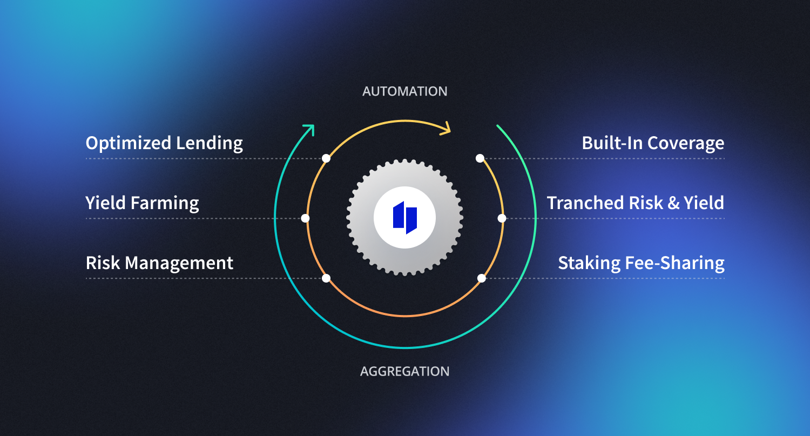

# 📥 Introduction

### Welcome to the [I**dle**](https://idle.finance/) **Docs**

The best place to find all the information you need to start using Idle protocol and collaborate with the Idle DAO.


**The Idle protocols** and **DAO** compose a decentralized organization that builds financial infrastructure for Web3. Businesses of every size, from brand new DeFi protocols to FinTech companies, use our protocol to _maximize capital efficiency_ and _manage their treasuries_ within DeFi.


<figure><figcaption></figcaption></figure>

We believe that _everyone deserves the best for their idle funds_, both in terms of returns and risks. We work with other DeFi protocols, security auditors, and regulators so businesses that run on Idle don’t have to.

### Why Idle?

To explain the rationale behind the naming <mark style="color:blue;">Idle</mark>, we need to borrow some concepts from the gaming world.

_Idle games_ live in the margins of digital games and automated applications. Idle Finance lives in the same margins of decentralised finance and automated smart contracts interactions. This genre of automated decentralised financial services requires little or no user interaction. Yield aggregators, or other kinds of structured primitives built-in DeFi, tap from this concept to simplify and minimise the interactions required by their users.

With _idle games_, active withdrawal from the game comprises an essential part of the gameplay as players wait for the game state to change over time. Same for Idle Finance, users actively check their balances growing with DeFi yields, waiting for their funds to change over time until they reach a specific threshold of financial satisfaction.

This mode of interaction is paradigmatic for the change of roles decentralised financial technologies have in our lives. Suddenly consumers could commission robo-advisors to move their cash to whoever is offering the best rates or to automatically refinance debt. Value-added services from multiple providers would be equally easy to access, meaning they would have to compete on price or terms. In other words, much like the open Internet, profits will be rapidly transformed into a consumer benefit.

## Idle docs Index

There are 4 main chapters in the idle documentation. Each chapter starts with a broad introduction covering the sections and subsections that follow to help you better understand the arguments addressed and easily find the answers to your questions.


[Broken link](broken-reference)


Presenting Idle's product suite, i.e. [Best Yield](products/best-yield/) and [Yield Tranches](products/yield-tranches/) as well as Idle DAO to DAO [Integration programs](products/integration-partners-program/).


[Broken link](broken-reference)


Presenting Idle [codebase](https://app.gitbook.com/o/-LwFtoytYZh7kXPdZp-v/s/-Lw-v0NTae0RVW1spR9R/\~/changes/fwSWEoG7SDdqwHYUrlhF/developers/contracts-and-codebase) and developers materials linked to [Best Yield](https://app.gitbook.com/o/-LwFtoytYZh7kXPdZp-v/s/-Lw-v0NTae0RVW1spR9R/\~/changes/fwSWEoG7SDdqwHYUrlhF/developers/best-yield-strategy) and [Yield Tranches](https://app.gitbook.com/o/-LwFtoytYZh7kXPdZp-v/s/-Lw-v0NTae0RVW1spR9R/\~/changes/fwSWEoG7SDdqwHYUrlhF/products/perpetual-yield-tranches).


[Broken link](broken-reference)


Presenting [Idle DAO](governance/idle-dao/) processes, [Idle Leagues](governance/idle-dao/idle-leagues/) structure and [$IDLE token](governance/idle/).


[Broken link](broken-reference)


Presenting Idle [glossary](other/golossary.md), additional [resources](other/resources.md), and [archive](other/archive/).&#x20;
