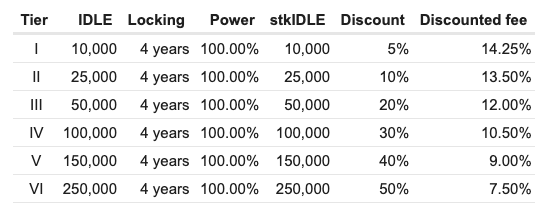

# Subgraph

Idle uses a [subgraph](https://thegraph.com/docs/about/introduction#what-the-graph-is) for indexing and organizing data from the Perpetual Yield Tranches `IdleCDO` smart contract. This subgraph can be found on The Graph hosted service and can be used to query Idle PYTs data:

* **PYTs subgraph:** [https://thegraph.com/hosted-service/subgraph/samster91/idle-tranches](https://thegraph.com/hosted-service/subgraph/samster91/idle-tranches)
* **Graphql endpoint:** [https://api.thegraph.com/subgraphs/name/samster91/idle-tranches](https://api.thegraph.com/subgraphs/name/samster91/idle-tranches)
* **Code:** [https://github.com/Idle-Labs/idle-tranches-subgraph](https://github.com/Idle-Labs/idle-tranches-subgraph)

<figure><figcaption></figcaption></figure>

### Useful entities

* _**TrancheInfos**_**:** contains the data of each PYTs tranche (type, apr, `virtualPrice`, `totalSupply`), updated every hour
* _**Tranche**_**:** all deployed PYTs tranches (id, type)

### Querying PYTs

To obtain the latest _TrancheInfos_ you can use the following query

```graphql
{ 
    trancheInfos(orderBy:"timeStamp", orderDirection:"desc") { 
        id
        apr
        Tranche { 
            id 
        }
        timeStamp
        blockNumber
        totalSupply
        virtualPrice
    }
}
```

For more info about GraphQL API, check [TheGraph Documentation](https://thegraph.com/docs/en/developer/graphql-api/).
