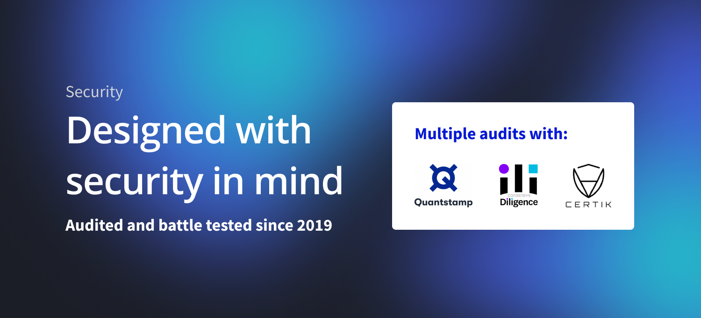

# Smart contract audits

<figure><figcaption></figcaption></figure>

### Best Yield

Idle protocol `idleTokens` [Best Yield contracts](https://github.com/Idle-Labs/idle-contracts) audits:



[https://certificate.quantstamp.com/full/idle-finance](https://certificate.quantstamp.com/full/idle-finance)



### Yield Tranches



Full audit of v1, up to this [commit](https://github.com/Idle-Labs/idle-tranches/tree/ff0b69380828657f16df8683c35703b325a6b656)

[https://consensys.net/diligence/audits/2021/06/idle-finance](https://consensys.net/diligence/audits/2021/06/idle-finance/)



Full audit

[https://www.certik.org/projects/idle-finance](https://www.certik.org/projects/idle-finance)



Solo audit of v2 by [Hans Friese](https://code4rena.com/@hansfriese)





### Governance

Idle [Governance contracts](https://github.com/Idle-Labs/idle-governance) audits:



[https://certificate.quantstamp.com/view/idle-goverance](https://certificate.quantstamp.com/view/idle-goverance)


