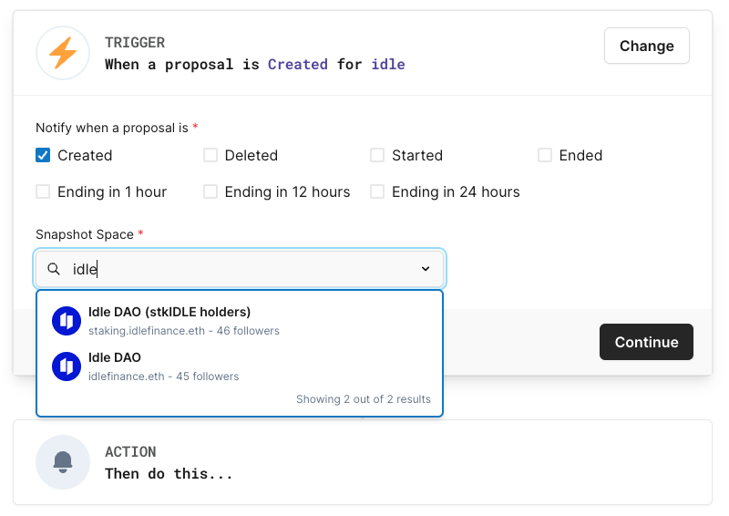

# How to monitor off-chain voting pools

Want to always keep up to date with the Idle DAO Governance process? Be alerted when a new Snapshot pool opens? All Governance news is constantly shared on the official [Governance Forum](https://gov.idle.finance/), [Twitter](https://twitter.com/idlefinance), [Discord](https://discord.gg/j6QyJQu) (#Announcements), and [Telegram](https://t.me/idlefinance) channels. Don’t forget to turn on notifications!

In addition, for the off-chain voting polls held on [Snapshot](https://snapshot.org/#/), the [Hal](https://www.hal.xyz/) platform allows users to receive personalized alerts whenever a new proposal is created, started, about to close, etc.&#x20;

The process is very straightforward. Follow this step-by-step tutorial:

1. Visit the Hal website at [https://www.hal.xyz/](https://www.hal.xyz/)&#x20;
2. Click on _Get Started_ and sign in with your email&#x20;
3. Click on _Create Notification_
4. Select Snapshots in the Trigger drop-down menu and enter “Idle DAO” in the Snapshot Space search bar. Idle DAO has two Snapshots pages
   * [IDLE Snapshot page](https://snapshot.org/#/idlefinance.eth)
   * [stkIDLE Snapshot page](https://snapshot.org/#/staking.idlefinance.eth)
5. Flag the trigger events for which you want to be notified and choose the actions that better suit your needs (i.e. E-mail, Discord or Telegram notification)

<figure><figcaption></figcaption></figure>

For specific support on how to activate alerts on Hal, please refer to their [official documentation in the _Actions_ section](https://dev.hal.xyz/how-it-works/actions).
