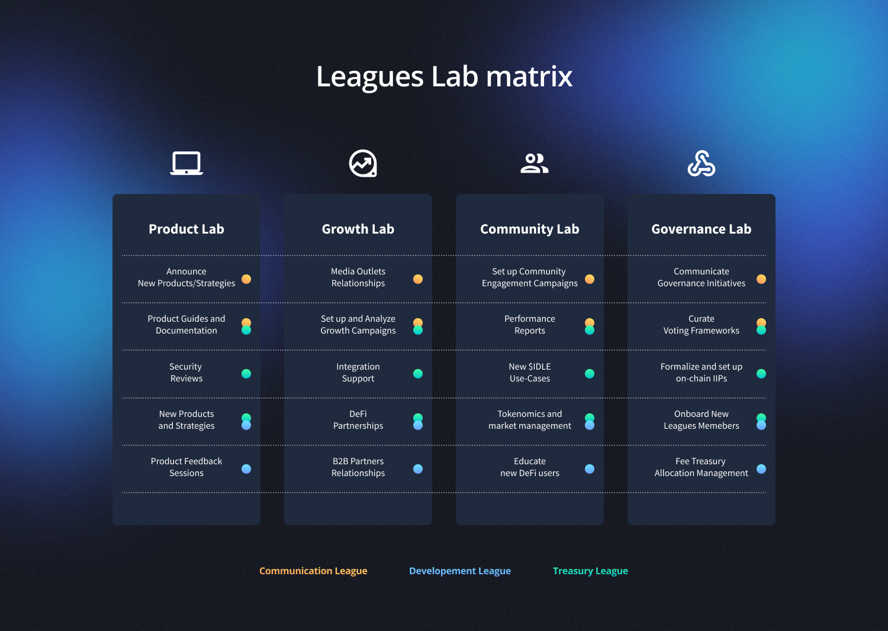

# Idle Leagues

## What is a League? 🛡&#x20;

_**Leagues are the Idle DAO’s solution to the scaling problems that DAOs are facing!**_

Leagues are working groups, centred around one area of expertise. They allow a fluid and fast organization of active contributors, as opposed to slow, inefficient, centralized, and rigid structures. Leagues are indeed flexible, ductile, and modular. They can be initiated by a group of active community members, embed or be embedded in other sub-DAOs, and split or merge.

Members are currently elected by $IDLE token holders through Snapshot polls, are in charge for one _Mandate_ (currently lasting 3 months) and then receive an operative budget through an on-chain proposal (voted by $IDLE token holders).

## Mission

Idle DAO's mission is to **ensure proper maintenance and evolution of the protocol in the years to come**.

Governance may have to deal with tech, business, legal, and administrative tasks, which usually in traditional companies are represented by departments. In a plain-vanilla DAO model, token holders are supposed to take decisions in several areas.

By delegating part of the executive power to specialised teams (sub-DAO aka Leagues), the cost of participation drops significantly. **The DAO’s decision process is thus more efficient without compromising on transparency or openness.** Furthermore, Leagues provide a canvas for talents to organically emerge to the relevant parts of the DAO.

The Leagues-DAO relationship is based on the concept of _collective intelligence_, which strongly contributes to the shift of knowledge and power from the individual to the collective. Collective actions or tasks require different amounts of coordination depending on the complexity of the task. Tasks vary from being highly independent simple tasks that require very little coordination to complex interdependent tasks that are built by many individuals and require a lot of coordination.

**Group collective intelligence is a property that emerges through coordination from both bottom-up and top-down processes.** In a bottom-up process, the different characteristics of each member are involved in contributing and enhancing coordination. Top-down processes are more strict and fixed with norms, group structures, and routines that in their own way enhance the group’s collective work.

> _**Collective intelligence is at the root of Leagues and Idle DAO effectiveness and efficiency**_

Leagues have been conceived to put people first. Their flexibility allows for dynamic and composable structures to be created around any group of contributors, giving the DAO a mechanism to be accountable and aligned in terms of incentives.&#x20;

**This approach splits risks & opportunities, allowing active members to take care of new business lines or scheduled DAO activities and get a reward for that.** The composition of DAOs/Leagues is designed to evolve based on Idle protocol and its community's needs and opportunities.

Leagues principles

These are the thesis we embodied when we designed Idle Leagues structure:

* Leagues are part of a blockchain-related technological and institutional innovation and an ongoing maturation phase of the Information Technology (IT) revolution, which includes the emergence of IT-native forms of socio-economic organization that are digital, global, and increasingly decentralized and automated.
* Leagues aim to help converting decentralized networks into fields — social arenas of symbolic and material production in which interested actors compete and cooperate over network-specific resources as they provision and consume the products and services available in the network.
* In addition to conventional market dynamics, an overarching factor driving the evolution of decentralized networks is the tension between ideology, reality, and financial incentives.
* Decentralized network governance consists of four main components: (1) leadership, vision, and values that attract and guide network participants; (2) rules inscribed in the relevant software protocols; (3) rules and regulations external to the relevant software protocols; (4) community coordination and management.
* Existing systems of decentralized network governance differ in two defining aspects: (1) whether rules around implementing changes to the relevant software protocols are included in the software itself; (2) the level of formalization and institutionalization of off-chain governance.
* Avoiding changes to the software or other system parameters helps preserve existing systemic tendencies; changing software or other system parameters may introduce new risk factors, but is also a powerful tool for enabling new systemic tendencies.
* Good decentralized network governance is one that steers the network through its various stages of development towards more innovative and socially useful functions, while adequately resolving conflicts between different stakeholders participating in or affected by the network.
* In networks that adopt a formal system of governance, distributing decision-making authority among different stakeholders, including the end-users of the network, is an effective form of decentralization and a safeguard against the abuse of concentrated power.
* The quality of non-expert decision-making in decentralized network governance is strongly influenced by political communication — a task that requires professionalization.
* Decentralized networks with governance models that are poorly defined or overly complex and resource-intensive tend to be at a long-term disadvantage relative to competing networks that optimize for procedural clarity, simplicity, and smart automation with emergency safeguards.

## Leagues structure

$IDLE token holders (the Governance) represent the **topDAO**, an entity able to allocate economic resources to the Leagues. The Leagues take care of the daily protocol maintenance, propose new ideas, interact with the crypto ecosystem and execute decisions taken by the Governance.

<figure><figcaption></figcaption></figure>

### Leagues Coordinators

Starting in January 2022, Idle Leagues introduced a new figure, the Coordinator.&#x20;

The Idle DAO will appoint one (senior) contributor as coordinator for each League, responsible to follow multiple initiatives and fostering effective teamwork among contributors.

<figure><figcaption></figcaption></figure>

Coordinators will play a key role in the Idle Leagues by acting as the link between the Idle DAO and the Leagues contributors. [**Coordinators' Proposals**](./#undefined) define the needed Leagues Structure for the mandate, the Roadmap they want to accomplish, and the required Budget. They would be accountable for prioritizing the work and taking both business value and tech aspects into consideration to direct Leagues members’ efforts towards the growth of the Idle DAO and its product suite.

Together with the introduction of the Coordinators figures, Idle Leagues will distribute a&#x20;

* **Bi-weekly Leagues update report:** restoring and improving the recurrent [Bi-weekly governance updates](https://gov.idle.finance/c/start-here/updates/20) that would allow the community to be on the same line with Leagues initiatives and results; Leagues will foster a more open conversation about forthcoming initiatives in Discord to hear the community’s ideas for the current and prospective initiatives to be implemented.

#### Coordinators Proposal

Proposal structure

[Governance forum post Proposal example](https://gov.idle.finance/t/m2-2022-coordinators-applications/952/2?u=biaf)

At the beginning of each mandate, there will be a 1-week window for Coordinators’ proposals submission. This is open to anyone and allows the community to maintain a decentralized framework to operate the Idle DAO.

The Coordinators Proposal is formed by:

* **Leagues Roadmap**
* **Leagues Budget**
* **Leagues Structure**

The _Leagues Roadmap_ is an essential part of a Coordinator Proposal, where the Coordinators specify their perspective, in as great detail as possible, on how to successfully achieve the Leagues Mandate goals they are proposing to onboard, and how they plan to organize and provide accountability into their use of the budget. Their responsibilities will be to coordinate efforts and foster cross-Leagues initiatives to reach the proposed roadmap.

Coordinators are required to define the _Leagues' Budget_, which allows them to meet their responsibilities by recruiting Contributors and sustaining the expenses for growth initiatives.

Lastly, Coordinators define the _Leagues Structure_. This illustrates the organizational structure of the Leagues that will be formed in order to achieve the Roadmap. The Structure shall describe the different Leagues that will be formed (e.g. the current Communication, Development, and Treasury) and the respective members for each League. Coordinators can propose positions that are already filled by contributors, otherwise, it will be their responsibility to recruit and fill the positions that are open for the mandate.

At the end of the mandate, the Coordinators can be re-elected via Snapshot vote (without the need for token holders to vote for each Leagues contributor), and a new Budget/Roadmap/Structure for Leagues can be assigned for the following quarter. The approved budget will be assigned to Coordinators via an on-chain IIP. If the Coordinators won’t be reelected, there will be another 1-week window for Coordinators’ proposals submission to elect new ones and reform the Leagues.


Any structural change to the Leagues that Coordinators want to propose during a specific mandate, should get approval from the community via a **Temperature Check** (in Snapshot) to avoid any edge cases and maintain an open process for the Leagues governance.


### Labs

When multiple and different Leagues members coordinate with each other on the same feature area, they form a Lab. Labs help build alignment across Leagues and aim to maintain it over the course of an initiative workflow (bearing in mind [Dunbar’s Number 2](https://en.wikipedia.org/wiki/Dunbar's\_number)).

<figure><figcaption></figcaption></figure>

Each League assigns a member to a specific Lab’s initiative who is then responsible to help coordinate the activity across Leagues by encouraging collaboration.

## Current implementation

There are three active Leagues, whose parameters (team composition, salary, budget, mandate) have been decided through [community proposals](https://gov.idle.finance/t/a-step-towards-idle-leagues-dev-treasury/419)

* [Communication League](communication-league.md)
* [Development League](development-league.md#areas-of-responsibility)
* [Treasury League](treasury-league.md)

A list of current Leagues contributors can be found [here](https://www.notion.so/idlelabs/ffe8115b7b53489ab0a7f84e656e4bb0?v=916250f54ff24daabad72cf095fd6d88).

Another League, [HR League](broken-reference) has been created to manage the relationships between the DAO and its contributors.&#x20;
