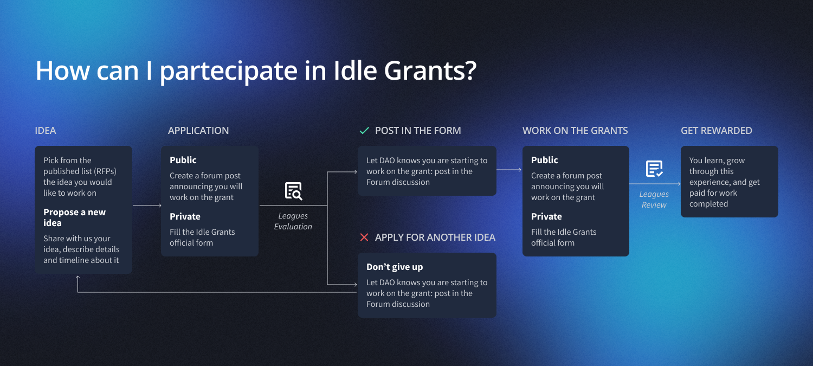

# Idle Grants program

### What is the Idle Grant program?

Idle Grants Program (IGP) is an opportunity to contribute to the Idle ecosystem, shape the future of finance, and level up individuals' technical and soft skills in DeFi, as part of a community of passionate contributors.

<figure><figcaption></figcaption></figure>

This program aims to grow the Idle DAO ecosystem and expand the number of contributors interested in building something for Idle, incentivizing them through rewards in $IDLE for the completed work.


Several contributors' ideas that benefited from the grant program have been released, helping to improve the protocol and Idle's current product suite.

The latest rewarded grants can be viewed [here](https://idlelabs.notion.site/f5ec438301d143ed8c0ea7118991450f?v=2ca01e7695fb4024b603082630ad45dc)



Furthermore, thanks to this initiative, many applicants who successfully completed grants joined the [development-league.md](idle-dao/idle-leagues/development-league.md "mention") as subDAOs contributors


### Request for Proposals (RFPs)

With the [release of the new version](https://medium.com/idle-finance/idle-grants-program-2-0-5f8466be7f20) of the grant program, Idle DAO has introduced the requests for proposals, a set of ideas that can be developed for the current needs of the protocol.

Through this, external contributors will have the opportunity to take inspiration and understand the work to be done and the reward for the completed grant.

The RFPs list is public and available [here](https://idlelabs.notion.site/Request-for-proposals-RFPs-79b52c752b544f60bcf879c2ba4b5674).

### Grant application process

<figure><figcaption></figcaption></figure>

Contributors can join the Idle Grants Program by applying in two different ways:\
<mark style="color:blue;">A)</mark> Picking an available RFP, where they can find a description of the work to be done and the relative range of reward ($ in IDLE token) given in case of final delivery of the work;\
<mark style="color:blue;">B)</mark> By proposing a new idea, specifying the category to which it belongs, its timeline, and the budget it requires.

Depending on the funds' request for the grant, the approval method will be different:



<mark style="color:blue;">**Requests <$15k**</mark>: funds are issued directly by the Idle [treasury-league.md](idle-dao/idle-leagues/treasury-league.md "mention")and the applications are publicly announced only if contributors will be selected.



<mark style="color:blue;">**Requests >$15k**</mark>: the application should be approved by the [idle-dao](idle-dao/ "mention").



### 📥  Apply [here](https://idlelabs.notion.site/IGP-Idle-Grants-Program-a91d2937f24c4539a6538e48777fbfbd) to the Idle Grants Program


More info about the grant application process is available at [Grants Guidelines](https://idlelabs.notion.site/Grants-Guidelines-a1f5e8938c4e4abfb5c9893e6322b89b)

