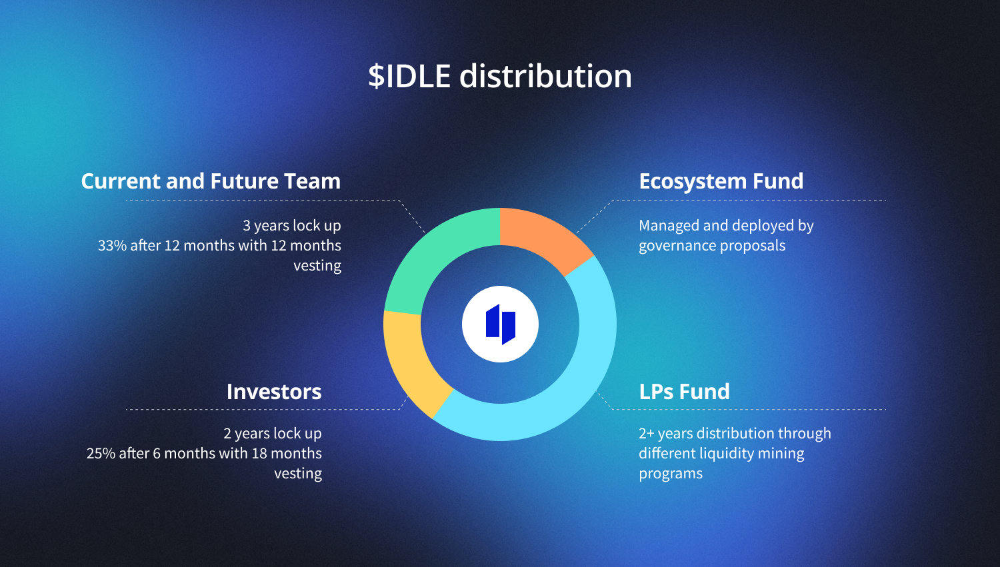
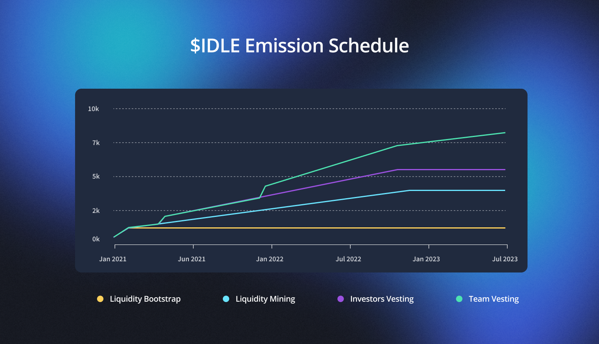

# Distribution

<figure><figcaption></figcaption></figure>

The IDLE distribution (via the LPs Fund) is broken down into three different programs:



_Status: Live_

This program will last 6 months and will use 30% of the $IDLE allocated to the liquidity mining program resulting in a 990 $IDLE/day distribution over a semester (178,200 $IDLE in total).

Currently, the Gauges system distributes rewards to Senior Perpetual Yield Tranches.



_Status: Live_

This program will last 2 years and is used to reward liquidity providers depending on the amount of funds deposited and the utility generated by the pool (APY of the pool); it will distribute **18%** **of the total supply (2'340'000 IDLE)** on a per-block basis across all Idle Best Yield strategies.\
\
Part of the funds devoted to liquidity mining for the BY strategy has been moved to the Gauges system of the Perpetual Yield Tranches.&#x20;



_Status: distribution voted by Idle DAO_

This program is meant to reward long-term actors and liquidity providers of the Idle ecosystem. **20%** **of the total supply (2'600'000 IDLE)** is allocated to this program.

The long-term distribution program won't start right at the governance launch, but 20% of the total supply has already been reserved and sent to the `LongLPFund` [`0x107A369bc066c77FF061c7d2420618a6ce31B925`](http://etherscan.io/address/0x107A369bc066c77FF061c7d2420618a6ce31B925) which is managed by the governance.



_Status: Ended_

This program distributed **3% of the total supply (390'000 IDLE)** to liquidity during the _first 30 days_ after governance inception. It has been based on the Liquidity Mining program with applied an x4 multiplier to the basic reward amount per block.



The _Liquidity Mining_ program distributes IDLE through the `IdleController` contract, which computes the utility generated by each BY strategy (idleDAI, idleUSDC, ...) and proportionally allocates the IDLE rewards between all these pools. \
To compute the utility generated by each strategy, the IdleController uses a `PriceOracle` which reads data such as WBTC or COMP price (in USD) and uses it to compute the correct share of LM program distribution for each pool. \
To update the _distribution speeds_, and effectively adjust the IDLE distribution for the strategies depending on current TVL and APYs, the public method `refreshIdleSpeeds` should be called from time to time.

Funds for the _Liquidity Mining_ and the _Liquidity Bootstrap_ programs have been sent to the `Reservoir` contract which progressively unlocks IDLE rewards for the `IdleController`. In order to transfer unlocked IDLE from the `Reservoir` to the `IdleController` the Reserve contract should be poked by calling the `drip` method.\
\
_Gauges_ rewards are distributed through the `Distributor`contract.


The governance is also responsible for managing the **Ecosystem Fund** [`0xb0aA1f98523Ec15932dd5fAAC5d86e57115571C7`](http://etherscan.io/address/0xb0aA1f98523Ec15932dd5fAAC5d86e57115571C7) which represents **15%** **of the total supply (1'950'000 IDLE).** This fund's purpose is to fund Idle DAO and its community.


Additionally, **4%** **of the total supply (520'000 IDLE)** has been reserved, at launch, to **Early LPs** through the Early Rewards contract [`0xa1F71ED24ABA6c8Da8ca8C046bBc9804625d88Fc`](http://etherscan.io/address/0xa1F71ED24ABA6c8Da8ca8C046bBc9804625d88Fc).&#x20;


Early Rewards not claimed 90 days after launch (26th November 2020) have been automatically transferred to the Ecosystem Fund.


The remaining 40% of the supply is allocated in the following manner:

* _Team + Future Team:_ 22.7% of the total supply (with a 3 year lockup: 33.33% unlocked after 1 year, 66.67% unlocked linearly for the next 24 months)
* _Investors:_ 17.3 % of the total supply (with a 2 year lockup: 25% unlocked after 6 months, 75% unlocked linearly for the next 18 months)

Both lockup schedules started on Nov 26th 2020, and are enforced through the following smart contracts:

Team + Future Team

* `0x06a44ce4A37DbA5a90267db93c144522d5C178f6`
* `0x9e5A7EeB2eB6BBb735c75075114090015040909F`
* `0xF1bD4d3f7E0172B9DAFCff91dEcD9F077ed01887`
* `0x2e56C44E571A8F926e2CD8CB247a7074559c64dc`&#x20;

Investors

* `0x57d2A95BEa18Ad894c35CE2Ca89C5928F9b2F912`
* `0x53967E3FfdAb0a0f2BcE097383C34eC0A3F0b0fE`
* `0xAEcF9166E9A7EF0F1eD1d399336cb92754d24C4b`
* `0x33ae303013a4D866683b35C0483AC6D613222005`
* `0x43fDd8d3E17A4E40ef97FED432B488105E620316`
* `0xd458632330Cc973F6dF36Ff576343E27060B4E77`
* `0x49d85B42c9B74355f7a0De600fD336E46d739201`
* `0x9201e5043d5f370B167CD4660941F0bE50C01736`
* `0x9366b9D783901d7eF7c7042064c55b0bA851Bda6`
* `0x317ABEF0674A3be3dc4442F189C89d89c14E70F8`
* `0x2c22d3689C5c66B8FB44702c05e25649955b2DD3`
* `0xEF5472af5F46538B9A929517D2E1442060A67f58`
* `0xCc1b0617783E162511Eea716929d879d78945814`
* `0x48856A3B565e985e6742102aD0e5b976D32386b5`
* `0xce65b6C59CfB37FD95Fe881317e6F8Bfe7830DEB`

<figure><figcaption></figcaption></figure>


The above IDLE emission schedule does not take into account the _Ecosystem Fund_ and the _LongTerm LPs Program_ funds. Those will be deployed via an IDLE community vote.

