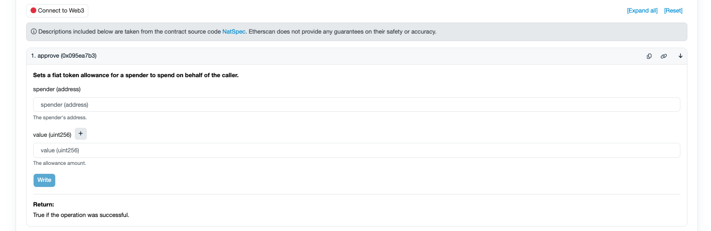
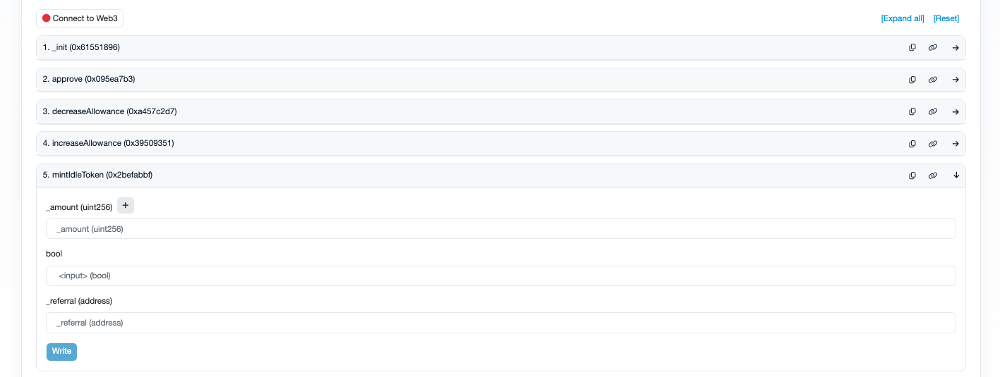
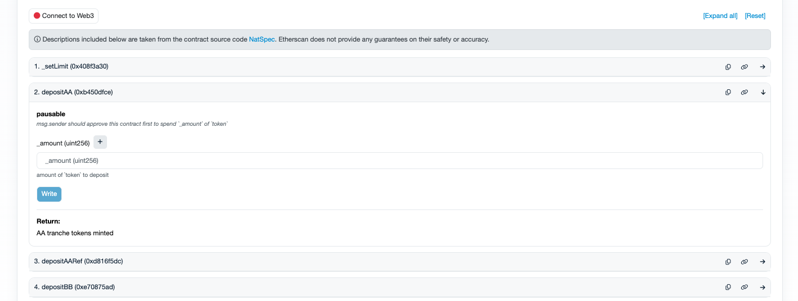

# Deposit funds through smart contracts

This tutorial will guide you in the process of depositing new funds into Idle directly from the smart contracts in case the website has limited access or is down.&#x20;

### **Before you start**

To ensure a smooth process be sure to have the following items ready:

* A supported EVM wallet (_Metamask_, _Coinbase wallet_,  Rabby)
* Underlying assets (DAI, USDC, USDT, WETH)
* Ether (ETH) to cover network fees (i.e. gas)

### A. Approve spending&#x20;

1. Visit the block explorer of the chain you want to deposit in (such as [Etherscan](https://etherscan.io/), [Polygonscan](https://polygonscan.com/), and [Optimistic Etherscan](https://optimistic.etherscan.io/))
2. On the block explorer, look for the token address you want to deposit. Always double-check the address with official token resources
3. Once found, visit the contract page, click on the _Contract_ tab, and then on _Write Contract._ If you see the _Write as Proxy_ option listed, use this one instead

<figure><figcaption></figcaption></figure>

4. Click on _Connect to Web3_ to connect your wallet
5. In the first method usually, you have the _Approve_ function. You will need to input:
   * the _Spender_, i.e. the Idle's vault address (NB -  use the _CDO_ address for [Yield Tranches](../../developers/yield-tranches/deployed-contracts/))
   * the _Value_, i.e. the amount you want to deposit unit converted. You can use [this tool](https://etherscan.io/unitconverter) to easily convert in multiple formats. Be careful in using the right amount of decimals for the token! NB - USDC and USDT have 6 decimals (10^6), DAI and WETH have 18 decimals (10^18)

<figure><figcaption></figcaption></figure>

6. Click on Write and execute your transaction

### B. Deposit

7. Visit the vaults' addresses of [Best Yield](../../developers/best-yield/deployed-contracts/) and [Yield Tranches](../../developers/yield-tranches/deployed-contracts/) and select the one you want to deposit to. For YTs, you need to always use the contract tagged as _CDO_
8. Follow the same steps above (3, 4) and then select the function [`mintIdleToken`](../../developers/best-yield/methods/mintidletoken.md) for BY (in the `bool` parameter write `True`) or [`depositAA`](../../developers/yield-tranches/methods/depositaa.md), [`depositBB`](../../developers/yield-tranches/methods/depositbb.md) for YTs (where AA stands for Senior and BB for Junior)

<figure><figcaption></figcaption></figure>

<figure><figcaption></figcaption></figure>

9. Input the amount you want to deposit, unit converted. Same as the point 5 above.&#x20;
10. Click on _Write_ and execute your Tx. If successful, you will see an outflow of the token selected and an inflow of the Idle's vault LP tokens.&#x20;


The same process can be done through a multisig, i.e. a smart contract, by building the Tx using the _Transaction Builder_ app. Safe fetches automatically the proper ABI of the contract.&#x20;


Need further help? Check our [guides](./) list or get in contact on [Discord](https://discord.com/invite/mpySAJp).
