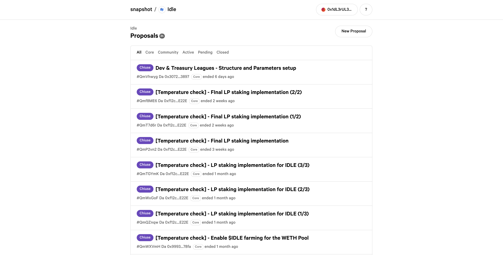

# Redeem funds on Ethereum

## Redeem funds

1. Users should visit the [Idle dashboard](https://app.idle.finance/#/dashboard) and connect their wallets.
2. Visit the strategy page of your choice and click on _Withdraw_ in the right panel
3. Input the amount you want to redeem and click on _Withdraw_

<figure><figcaption></figcaption></figure>

### Redeem only **farmed rewards**

1. Click **"**_Show advanced options"_.
2. Click the checkbox "_Redeem governance tokens only"_.
3. Click "_Redeem Gov Tokens"_.
4. Click "_Confirm"_ in your wallet to redeem the governance tokens.
5. Go to the respective strategy page, look under "_Deposited assets"_ for the token you wish to redeem, and click "_Manage"_.
   1. To redeem the deposited assets and any farmed governance tokens, you can either enter a specific amount by manually typing a value in the box, or select the predefined percentages to automatically calculate a value based on your balance, then click "_Redeem"_.
   2. Click "_Confirm_" to redeem the asset.
   3.  You will now own your tokenized asset and any redeemed governance tokens less the current performance fee that is taken from positive returns (performance fee does not apply to $IDLE).&#x20;

       By clicking on your wallet, you can see your current portfolio assets and $IDLE balance.

<figure><figcaption></figcaption></figure>

### Redeem only **farmed governance tokens**

1. Click **"**_Show advanced options"_.
2. Click the checkbox "_Redeem governance tokens only"_.
3. Click "_Redeem Gov Tokens"_.
4. Click "_Confirm"_ in your wallet to redeem the governance tokens.

### Redeem only **deposited assets**

1. Click "_Show advanced options_".
2. Click the checkbox "_Redeem without governance tokens"_.
3. Select the governance tokens you want to forfeit, and the checkbox to acknowledge you are giving away these tokens.
4. Enter an amount by manually typing a value in the box, or select the predefined percentages to automatically calculate a value based on your balance, then click "_Redeem"_.
5. Click "_Confirm"_ in your wallet to redeem the asset.


Currently, this can only be done by forfeiting farmed governance tokens.


Need further help? Check our [guides](../) list or get in contact on [Discord](https://discord.com/invite/mpySAJp).
