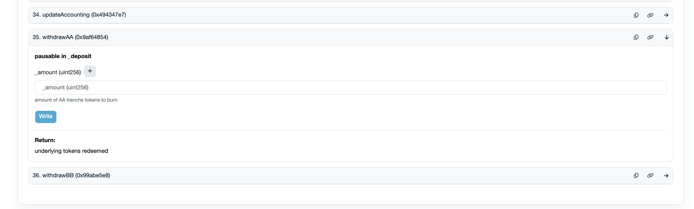

# Redeem funds through smart contracts

This tutorial will guide you in the process of redeeming funds from Idle directly from the smart contracts in case the website has limited access or is down.&#x20;

### A. Redeem

1. Visit the vaults' addresses of [Best Yield](../../developers/best-yield/deployed-contracts.md) and [Yield Tranches](../../developers/yield-tranches/deployed-contracts/) and select the one you want to redeem from. For YTs, you need to always use the contract tagged as _CDO_
2. Click on the _Contract_ tab, and then on _Write as Proxy_
3. Click on _Connect to Web3_ to connect your wallet
4. Select the function [`redeemIdleToken`](../../developers/best-yield/methods/redeemidletoken-1.md) for BY or [`withdrawAA`](../../developers/yield-tranches/methods/withdrawaa.md), [`withdrawBB`](../../developers/yield-tranches/methods/withdrawbb.md) for YTs (where AA stands for Senior and BB for Junior)
5. Input the LP token amount you want to redeem unit converted. You can use [this tool](https://etherscan.io/unitconverter) to easily convert in multiple formats. Idle LP tokens have always 18 decimals (10^18).&#x20;
6. Click on _Write_ and execute your Tx. If successful, you will see an outflow of the LP token selected and an inflow of the principal token.

<figure><figcaption></figcaption></figure>


The same process can be done through a multisig, i.e. a smart contract, by building the Tx using the _Transaction Builder_ app. Safe fetches automatically the proper ABI of the contract.


Need further help? Check our [guides](./) list or get in contact on [Discord](https://discord.com/invite/mpySAJp).
