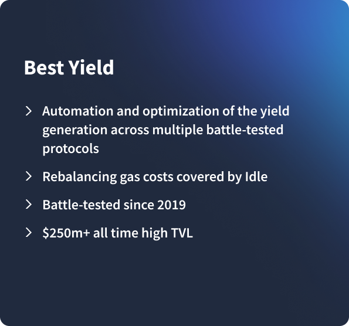

# Overview

Based on the different aggregated yield sources, there are three types of Best Yield strategies:

1. **“OG” Best Yield**: the original Best Yield strategy, automatically maximizing capital efficiency across the over-collateralized, top-tier lending protocols Aave and Compound.
2. **Senior Best Yield**: expanding the underlying sources of OG Best Yield by adding Senior Tranches alongside existing sources Aave and Compound, maintaining the same conservative risk profile while extending and improving the yield spectrum.
3. **Junior Best Yield**: aggregating multiple Idle Junior Perpetual Yield Tranches on a single asset as underlying to create a new tier of risk in Best Yield, allowing to automate an aggressive approach and to offer significantly higher APYs.

<figure><figcaption></figcaption></figure>

## How does Best Yield work?

The Best Yield strategies constantly monitor interest rates on various DeFi yield sources to ensure the current allocation is yielding the best aggregate interest rate available on the market.

Users' funds are pooled together and programmatically deposited into one or more of the available lending protocols.&#x20;

<figure><figcaption></figcaption></figure>


By analyzing supply rate functions across integrated platforms and total funds in the pool, the strategy is able to constantly rebalance capital across any number of protocols to **earn the highest interest rate possible** with very high precision.


When users deposit funds, they receive `idleTokens` from Idle in exchange. `idleTokens` are ERC-20 tokens that can be redeemed for their underlying assets at any time. As interest accrues to the assets supplied, `idleTokens` are redeemable at an exchange rate (relative to the underlying asset) that constantly increases over time, based on the rate of interest earned by the underlying asset.

## Allocation model

Best Yield strategies maximise the current aggregated interest rate, modelled as follows

$$
max\ q(x)= \sum_{i=0}^{n} \frac{x_i}{tot} * nextRate_i(x_i)
$$

where `n` is the number of lending protocols used, `x_i` is the amount (in underlying) allocated in the protocol `i` , `nextRate(x_i)` is a function that returns the new APR for protocol `i` after supplying `x_i` amount of underlying and is `tot` the total

$$
tot=\sum_{i=0}^{n} x_i
$$

## Protocols and assets&#x20;

Currently, the Best Yield strategies are available on Ethereum and Polygon blockchains. Each network has a different basket of assets available in the pools.


Idle DAO has established a series of [Integration Standard Requirements](../../developers/security/integration-standard-requirements.md) required to implement a new yield source or an asset in the Best Yield strategy.


### Ethereum



#### Integrated protocols

* [Compound](https://compound.finance/)
* [Aave](https://aave.com/)

#### Integrated assets

* [DAI](https://etherscan.io/address/0x3fe7940616e5bc47b0775a0dccf6237893353bb4)
* [WBTC](https://etherscan.io/address/0x8C81121B15197fA0eEaEE1DC75533419DcfD3151)



#### Integrated protocols

* [Compound](https://compound.finance/)
* [Aave](https://aave.com/)
* [Senior Perpetual Yield Tranches](../perpetual-yield-tranches/overview.md#senior-tranches) on [Lido](https://lido.fi/), [Euler](https://www.euler.finance/), [Morpho](https://www.morpho.xyz/) and [Clearpool](https://clearpool.finance/) markets

#### Integrated assets

* [USDC](https://etherscan.io/address/0x5274891bEC421B39D23760c04A6755eCB444797C)
* [USDT](https://etherscan.io/address/0xF34842d05A1c888Ca02769A633DF37177415C2f8)
* [WETH](https://etherscan.io/address/0xc8e6ca6e96a326dc448307a5fde90a0b21fd7f80)



#### Integrated protocols

* [Junior Perpetual Yield Tranches](../perpetual-yield-tranches/overview.md#senior-tranches) on [Lido](https://lido.fi/), [Euler](https://www.euler.finance/), [Morpho](https://www.morpho.xyz/) and [Clearpool](https://clearpool.finance/) markets

#### Integrated assets

* [DAI](https://etherscan.io/address/0xeC9482040e6483B7459CC0Db05d51dfA3D3068E1)
* [USDC](https://etherscan.io/address/0xDc7777C771a6e4B3A82830781bDDe4DBC78f320e)
* [USDT](https://etherscan.io/address/0xfa3AfC9a194BaBD56e743fA3b7aA2CcbED3eAaad)



### Polygon



#### Integrated protocols

* [Compound](https://compound.finance/)
* [Aave](https://aave.com/)

#### Integrated assets

* [DAI](https://polygonscan.com/token/0x8f3cf7ad23cd3cadbd9735aff958023239c6a063)
* [USDC](https://polygonscan.com/token/0x2791bca1f2de4661ed88a30c99a7a9449aa84174)
* [WETH](https://polygonscan.com/token/0x7ceb23fd6bc0add59e62ac25578270cff1b9f619)



## Benefits of using Best Yield

* A superior _optimisation algorithm_ for automatic management of users' funds;&#x20;
* Gas fees savings for funds rebalance (which the user would have to pay to deposit funds/interact from one platform to another);&#x20;
* Participating in the $IDLE liquidity mining program and leveraging all the advantages linked to its [multiple use cases](../../governance/idle/use-cases/);&#x20;
* By depositing into BY pools users can get other underlying governance tokens as a form of incentives (e.g. COMP or AAVE);&#x20;
* For integrators, no need to stitch together disparate protocols or spend months integrating and updating yield functionality.
