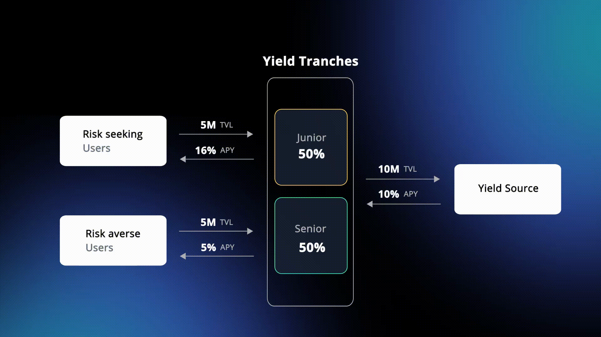

# Adaptive Yield Split

> The Adaptive Yield Split is a unique feature of YTs that manages the return distribution dynamically conditional to the liquidity deposited on each side (Senior/Junior) of the Tranche.

<figure><figcaption></figcaption></figure>

Mathematically, the formulas behind this mechanism consider mainly [Senior and Junior liquidity ratios](adaptive-yield-split.md#liquidity-ratios) to compute [Senior and Junior returns](adaptive-yield-split.md#senior-and-junior-yields).


Please note that these labels slightly change at the contract level. The Senior TVL ratio is `_AATrancheSplitRatio` and the Senior Yield share is `_trancheAPRSplitRatio`.


### Liquidity ratios

First, we define the Senior and Junior TVL ratios as

$$
\text{TVL ratio}_{Sr} = \frac{\text{Liquidity}_{Senior}}{\text{Liquidity}_{Senior + Junior}}
$$

$$
\text{TVL ratio}_{Jr} = \frac{\text{Liquidity}_{Junior}}{\text{Liquidity}_{Senior + Junior}}
$$

### Senior and Junior yields

The Senior return can be calculated as

$$
\text{APY}_{Sr} = \text{Base APY} \times \text{Yield share}_{Sr} \qquad \tag{1}
$$

where the _Base APY_ is the underlying Tranches yield and the _Yield share_ of the Senior side is a piecewise function conditional to the liquidity on the Senior tranche.&#x20;

$$
\text{Yield share}_{Sr} = 
    \begin{dcases}
        99\% & \text{if } \text{TVL ratio}_{Sr} \geq 99\%  \\
        \\
         \dfrac{\text{Liquidity}_{Senior}}{\text{Liquidity}_{Senior + Junior}} & \text{if } \text{TVL ratio}_{Sr} > 50\%  \\
        \\
        50\% & \text{if } \text{TVL ratio}_{Sr} \leq 50\%  \\
    \end{dcases}
$$

The Junior return can be calculated as

$$
\text{APY}_{Jr} = \frac{(\text{Base APY} - \text{APY}_{Sr}) \times \text{TVL ratio}_{Sr}}{\text{TVL ratio}_{Jr}} + \text{Base APY} \qquad \tag{2}
$$

**Normal case**

When Senior liquidity represents 50-99% of the funds in the Tranche, we use [Equation (1) ](adaptive-yield-split.md#senior-and-junior-yields)to compute the Yield share of the Senior side.

Alternatively, we use some fixed percentages. There are two **hedge cases**:

1. The majority of total Tranche's liquidity lying on the Senior side (more than 99%)
2. Less than half of total Tranche's liquidity lying on the Senior side (less than 50%)

$$
\text{Yield share}_{Sr} = 
    \begin{dcases}
        99\% & \text{if } \dfrac{\text{Liquidity}_{Senior}}{\text{Liquidity}_{Senior + Junior}} \geq 99\%  \\
        \\
        50\% & \text{if } \dfrac{\text{Liquidity}_{Senior}}{\text{Liquidity}_{Senior + Junior}} \leq 50\%  \\
    \end{dcases}
$$

In the first case, we set the Yield share of Senior Tranches equal to 99% while in the second case, we set it equal to 50%. These two hedge cases link to the principle that

> * **Senior Tranche** receives most of the underlying yield when liquidity is low on the Junior side (i.e. low coverage on Senior funds), or receives a guaranteed minimum portion of the underlying yield when Junior liquidity is high (i.e. high coverage on Senior funds);
> * **Junior Tranche** receives outperforming APYs on the Junior Tranches, no matter what the amount of deposited liquidity on the Senior is.

The _guaranteed minimum portion_, aka the _Yield share_ of the Senior Tranches, has been set to half the _Base APY_ (see HC#2) when the Senior liquidity is smaller than the Junior one.

### Senior coverage and Junior overperformance

The formulas of the Senior coverage provided by the Junior counterparty and the Junior boosted yield vs the underlying return are

$$
\text{Coverage}_{Sr} = \frac{\text{Liquidity}_{Junior}}{\text{Liquidity}_{Senior}}
$$

$$
\text{Overperformance}_{Jr} = \frac{\text{APY}_{Jr}}{\text{Base APY}}
$$

The Senior coverage should not be confused with the overall Tranche coverage that is computed in proportion to the whole tranche TVL

$$
\text{Tranche coverage} = \frac{\text{Liquidity}_{Junior}}{\text{Liquidity}_{Tranche}}
$$

### Examples

We compute the returns of the Senior and the Junior sides using the formulas listed previously, assuming

* An average underlying yield, _Base APY_, of 10%
* The total liquidity of the Tranche, _Tranche TVL_, equal to $10,000,000

**Standard case**: between 50 and 99% of the total Tranche's liquidity lying on the Senior side

| Side   | Liquidity | Expected APY |
| ------ | --------- | ------------ |
| Senior | $8m       |  8%          |
| Junior | $2m       | 18%          |

The Senior Yield share is equal to 80%.&#x20;

Senior funds coverage is 25% and the Junior overperformance vs base APY is 1.8x. The Tranche coverage is 20%.&#x20;

**Hedge case 1**: the majority of total Tranche's liquidity lying on the Senior side ($$\geq$$99%)

| Side   | Liquidity | Expected APY |
| ------ | --------- | ------------ |
| Senior | $9.9m     | 10%          |
| Junior | $100      | 20%          |

The Senior Yield share is set to 99% (HC#1).&#x20;

Senior funds coverage is 0% and the Junior overperformance vs base APY is 1.99x. The Tranche coverage is 0% as well.

**Hedge case 2**: less than half of the total Tranche's liquidity lying on the Senior side ($$\leq$$50%)

| Side    | Liquidity | Expected APY |
| ------- | --------- | ------------ |
| Senior  | $4m       |  5%          |
| Junior  | $6m       | 13%          |

The Senior Yield share is set to 50% (HC#2).&#x20;

Senior funds coverage is 150% and the Junior overperformance vs base APY is 1.33x. The Tranche coverage is 60%.

<figure><figcaption></figcaption></figure>
