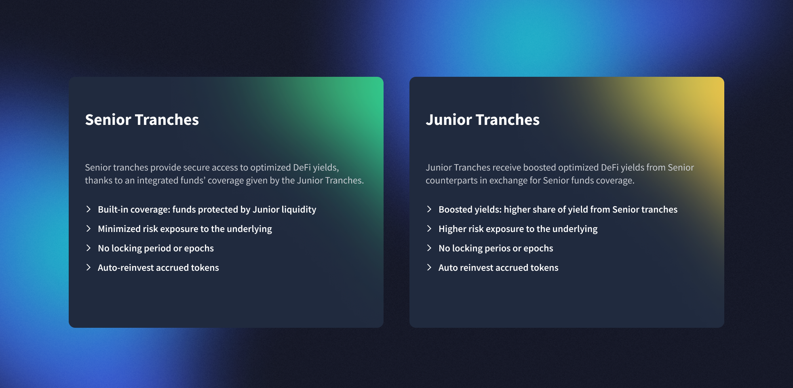

# Overview

## How do Yield Tranches work?

The product offers two classes of tranches, differentiated by the level of risk and the share of underlying yield assigned to each class.

<figure><figcaption></figcaption></figure>



This class of tranche offers **intrinsic protection on funds**, given by Junior class deposits. Each pool is composed of yield-bearing tokens, and the pool’s NAV is meant to only increase. A decrease in the NAV triggers the emergency shutdown to protect YTs liquidity providers.\
\
Senior Tranches intrinsically **have a first lien on the underlying assets** — they’re first in line to be repaid in case of default (hack or loss of funds). This product provides **full-spectrum coverage**, as the loss is covered regardless of the dependency or underlying protocol that caused it. Junior TVL will cover Senior TVL from a full spectrum of oracle/smart contract risks on:&#x20;

* Yield Tranches themselves;&#x20;
* Underlying yield source;&#x20;
* All the dependencies of the underlying yield source.



This class of tranche achieves a **greater and leveraged yield** by dragging more risk, as Junior holders have a second lien or no lien at all in case of fund losses.&#x20;

Junior tranche is designed to receive a higher share of yield compared to the Senior class, which will proportionally compensate for the higher risk taken by Junior depositors.



## Adaptive Yield Split

The [Adaptive Yield Split](https://medium.com/idle-finance/adaptive-yield-split-foster-pyts-liquidity-scalability-a796fa17ea35) is the mechanism that computes the APY split between Senior and Junior Tranches. It is dynamically conditional to the liquidity deposited on each tranche side. This mechanism lets:

* **Senior Tranche** receives most of the underlying yield when liquidity is low on the Junior side (i.e. low coverage on Senior funds), or receives a guaranteed minimum portion of the underlying yield when Junior liquidity is high (i.e. high coverage on Senior funds);
* **Junior Tranche** receives outperforming APYs on the Junior Tranches, no matter what the amount of deposited liquidity on the Senior is.

<figure><figcaption>
Returns examples vs a Base APY of 10%
</figcaption></figure>

More technical details regarding this split mechanism can be found in the dedicated section.


[adaptive-yield-split.md](adaptive-yield-split.md)


## Protocols and assets

Yield Tranches are available on Ethereum, Polygon zkEVM, and Optimism for multiple protocols and underlying assets.

### Ethereum mainnet



[Lido](https://lido.fi/) enables users to mint transferable utility tokens (stETH), which receive rewards linked to the related validation activities of writing data to the blockchain, while the tokens can be used in other on-chain activities.

#### Integrated assets

* [stETH](https://etherscan.io/address/0x34dcd573c5de4672c8248cd12a99f875ca112ad8)
* [MATIC](https://etherscan.io/address/0xF87ec7e1Ee467d7d78862089B92dd40497cBa5B8)


stMATIC YTs accept MATIC as the deposited asset to give users a seamless experience by staking their tokens in a few clicks. When users want to redeem, stMATIC YTs generate an NFT representing the underlying capital. After 2–3 days, the average waiting period for stMATIC unstaking, users can finalize their withdrawal.




[Instadapp](https://instadapp.io/) leverages stETH against standard ETH to gain an increased amount of staking rewards.

#### Integrated assets

* [stETH](https://etherscan.io/address/0x34dcd573c5de4672c8248cd12a99f875ca112ad8)



[Morpho](https://morpho.org/) is a peer-to-peer layer built on top of the main DeFi lending pools offering a trustless lending primitive.

**Curators:** [Block Analitica](https://blockanalitica.com/) and [B.Protocol](https://www.bprotocol.org/), [Steakhouse](https://www.steakhouse.financial/)

#### Integrated assets

* [USDC](https://etherscan.io/address/0x9C13Ff045C0a994AF765585970A5818E1dB580F8)
* [WETH](https://etherscan.io/address/0xb3F717a5064D2CBE1b8999Fdfd3F8f3DA98339a6)



[Clearpool](https://clearpool.finance/) is a DeFi ecosystem incorporating the first-ever permissionless marketplace for unsecured institutional liquidity.

**Borrowers:** [Portofino](https://www.portofino.tech/), [Fasanara](https://www.fasanara.com/)

#### Integrated assets

* [DAI](https://etherscan.io/address/0xDcE26B2c78609b983cF91cCcD43E238353653b0E)
* [USDC](https://etherscan.io/address/0xDBCEE5AE2E9DAf0F5d93473e08780C9f45DfEb93)
* [USDT](https://etherscan.io/address/0xc4574C60a455655864aB80fa7638561A756C5E61)



[Gearbox](https://gearbox.fi/) brings together lending and prime brokerage in the same protocol offering de facto composable leverage.

#### Integrated assets

* [USDC](https://etherscan.io/token/0xa0b86991c6218b36c1d19d4a2e9eb0ce3606eb48)
* [WETH](https://etherscan.io/token/0xc02aaa39b223fe8d0a0e5c4f27ead9083c756cc2)



[Ethena](https://www.ethena.fi/) manages the synthetic dollar USDe meant to be the first internet bond thanks to the combination of yields generated through staking and derived from the funding and basis spread of perpetual and futures markets.

#### Integrated assets

* [USDe](https://etherscan.io/token/0x4c9edd5852cd905f086c759e8383e09bff1e68b3)



### **L2s**



**Clearpool**

Clearpool is a DeFi ecosystem incorporating the first-ever permissionless marketplace for unsecured institutional liquidity.

**Borrowers:** [Portofino](https://www.portofino.tech/)

#### Integrated assets

* [USDT](https://zkevm.polygonscan.com/token/0x1e4a5963abfd975d8c9021ce480b42188849d41d)



**Clearpool**

Clearpool is a DeFi ecosystem incorporating the first-ever permissionless marketplace for unsecured institutional liquidity.

**Borrowers:** [Portofino](https://www.portofino.tech/), [Fasanara](https://www.fasanara.com/), [Wincent](https://www.wincent.co/), [Bastion](https://bastiontrading.com/)

#### Integrated assets

* [USDC](https://optimistic.etherscan.io/token/0x0b2c639c533813f4aa9d7837caf62653d097ff85)
* [USDT](https://optimistic.etherscan.io/token/0x94b008aa00579c1307b0ef2c499ad98a8ce58e58)



LPs receive `IdleCDO_AA_StrategyName` (e.g. `IdleCDO_AA_idleDAIYield`) for Senior deposits and `IdleCDO_BB_StrategyName` for asset provision in the Junior class. Both tokens are fully fungible ERC-20.

Some Tranches are labeled as _Experimental_, meaning some deposit limits (caps) exist.

## Yield and loss scenarios

> Given the nature of the two classes of tranches, which differ in terms of risks and gains opportunities, it is possible to explain their behavior through two scenarios: a **Yield case** and a **Loss case.**

Let's assume to have a DAI pool generating a 10% yield, where users deposit $10m split as follows

* 70% on Senior Tranche, i.e. $7m
* 30% on Junior Tranche, i.e. $3m

<figure><figcaption></figcaption></figure>

There can be two scenarios:

1. When the loss is higher than the Junior liquidity, the Senior Tranche will also In the **Yield case**, the interests generated in the pool ($1m DAI in total) will be split as $490k DAI (70% of the interest) to the Senior Tranche and $510k DAI (30% of the interest) to the Junior Tranche. As expected, The yield is higher for the Junior Tranche because, as mentioned, this class takes more risk than the Senior one and is rewarded accordingly.
2. In the **Loss case** (with the loss being lower than the Junior liquidity), the only class of tranches affected by a possible loss will be the Junior one. Suppose, there is a $1m DAI hack loss, the Senior tranche will have the entire (100%) capital protected, while Junior tranches will bear a partial loss (33%) of the funds deposited.
   * In the case when the loss is higher than the Junior liquidity, also the Senior Tranche will suffer from the hack. Its loss will be anyway mitigated by the Junior counterparty.&#x20;

## Benefits of using Yield Tranches

* Cheaper transactions’ deposits and redeems;
* Governance tokens (COMP, stkAAVE, LDO, CVX, CRV) automatically harvested to boost yields;
* Deposits and withdrawals are possible at any time due to no locking periods or epochs;
* No hidden fees: 10-15% performance fee.
